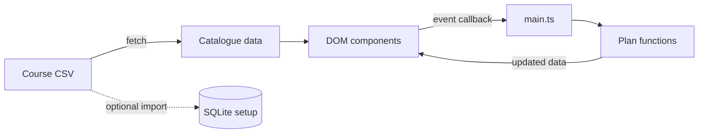

# How this version follows COMP350

The course notes are at <https://kreauniv.github.io/comp350/>. The two homework
documents this prototype grew out of are [hw1-proposal.md](hw1-proposal.md)
and [hw2-components.md](hw2-components.md); [sequence-diagram.md](sequence-diagram.md)
shows the whole thing as one picture.

## Scope first

The [PIM chapter](https://kreauniv.github.io/comp350/pim.html), under “Feature space”,
suggests starting with a small working version built from forms and links.
This version lets someone choose subjects, search a catalogue, inspect a course,
and add or remove courses from a trimester table. Credit totals are simple sums.

[HW1](hw1-proposal.md) describes the larger degree-planning problem. [HW2](hw2-components.md)
describes a browser, API and database, plus many future features. We keep those three boundaries
while limiting what they do today. The MVP constraints replace HW2's proposed
Svelte/PostgreSQL choices with vanilla TypeScript and SQLite.

The main data is a **course**: code, title, subjects, credits and description,
defined in `src/types.ts`. A **plan** is an object whose keys identify trimesters
and whose values are arrays of courses. Adding/removing changes these arrays;
rendering reads them and builds the table. Files, HTTP and the DOM provide I/O
around those ordinary data operations.

## Concepts and where to find them

| Class topic | Use in this project |
| --- | --- |
| [HTML and DOM](https://kreauniv.github.io/comp350/html.html) | `index.html` has labelled controls, sections and a table. Components create nodes with `document.createElement` and fill them with `textContent`. |
| [JavaScript](https://kreauniv.github.io/comp350/js.html) | Arrays hold courses, an object holds placements, functions change/render them, and click/input events call those functions. TypeScript adds simple type declarations. |
| [File abstraction](https://kreauniv.github.io/comp350/file.html) | `data/courses.csv` is the source snapshot. The browser reads it over HTTP; the optional importer reads the same file from disk. |
| [Factoring](https://kreauniv.github.io/comp350/factor.html) | `plan.ts` manipulates data without DOM or network calls. Components render it. `main.ts` connects these functions; `data/catalogue.ts` owns the catalogue download. |
| [JSON](https://kreauniv.github.io/comp350/json.html) | `/api/health` returns a JSON object. Future plan representations are written below. |
| [REST](https://kreauniv.github.io/comp350/rest.html) | The server is ready for routes under `/api/`. Only the health check is implemented; the resource contract below is a plan for later work. |
| [Data modelling](https://kreauniv.github.io/comp350/data.html) | `server/schema.sql` defines rows, keys and references. CSV import uses SQL parameters (`?`), not SQL made from user text. |
| [Concurrency](https://kreauniv.github.io/comp350/conc.html) | `fetch` uses `async`/`await`. The import runs inside a transaction, so a failed row rolls back the batch. |
| [Trust](https://kreauniv.github.io/comp350/trust.html) | Text enters the DOM through `textContent`. Only designated public files are served: the planner and project pages (`/about`, `/abstract`, `/components`, `/sequence`), the compiled `/assets/`, the course CSV and the PDFs/images under `/docs/`. A future write API will have to validate browser input and decide whose plan may be changed. |

## Follow one interaction

1. The user chooses a target trimester and presses Add in `catalogue.ts`.
2. The callback in `main.ts` calls `addCourse` in `plan.ts`.
3. `addCourse` checks for a duplicate and adds the course to an array.
4. `renderBoard` rebuilds the table from that object and sums its credits.
5. A status message reports the result. No request or database write happens.

[sequence-diagram.md](sequence-diagram.md) draws this, plus the database setup
and the health check, with Admin, User, Server and Database as the participants.



## Backend setup and the next step

The schema has `course`, `subject`, `course_subject`, `plan` and `plan_item`.
The join table lets one course belong to several subjects. A placement references
a course instead of copying its title/credits. The key `(plan_id, course_code)`
prevents one course being counted twice within a plan.

`npm run db:init` creates these tables. `npm run db:import` imports the course
snapshot once. Neither command adds saved-plan behaviour to the frontend.

Proposed resource endpoints, **not implemented yet**:

| Method | Resource | Meaning |
| --- | --- | --- |
| GET | `/api/courses` | Read the catalogue from SQLite |
| GET / POST | `/api/plans` | List plans / create a plan |
| GET / PUT / DELETE | `/api/plans/:id` | Read / replace / delete one plan |

Example plan request body:

```json
{
  "name": "My first plan",
  "major": "computer science",
  "minor": null,
  "items": [{ "code": "COMP201", "year": 2, "trimester": 1 }]
}
```

Hints, prerequisites, degree validation, automatic paths, login, sharing and
scraping remain outside this version. The frontend deliberately keeps its plan
only in memory until the page reloads.
