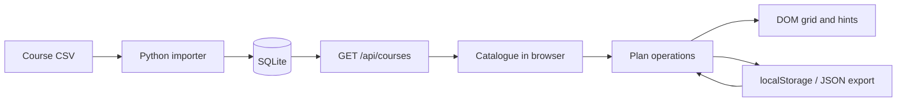

# How this uses COMP350

This prototype follows the topics in the [course notes](https://kreauniv.github.io/comp350/index.html).
It uses ordinary HTML, CSS, JavaScript, Python and SQL. Components are functions
that build DOM elements, not a UI framework.

| Course topic | Concrete use here |
| --- | --- |
| Files and the shell | The CSV is a source file; SQLite is a database file. `npm run db:import`, `build`, `check` and `test` are repeatable shell commands. |
| Git | Small commits record separate changes to layout, data operations and tests. |
| Regular expressions | API route matching in `server/app.py`; input/source checks and the CSV parsing boundary. |
| JSON | `fetch('/api/courses')` reads JSON. `storage.js` serializes plans and parses imported files, checking version, term IDs, course IDs and duplicate placements. |
| HTML/XHTML and DOM | Labelled inputs, semantic tables, native dialogs, `createElement`, `textContent` and CSS selectors. Imported text never becomes executable HTML. |
| JavaScript | Arrays of courses, a plan object keyed by trimester, native `import`/`export`, event callbacks and functions that transform data. |
| Interface / implementation | `plan.js` knows nothing about the DOM or HTTP. Renderers receive callbacks. Storage validates its input before changing the active plan. |
| REST | Course and plan resources use GET, POST, PATCH, PUT and DELETE. Responses have HTTP status codes and JSON bodies. Only the catalogue endpoint is currently called by the UI. |
| Data modelling | `course`, `subject`, `course_subject`, `plan` and `plan_item` use keys and foreign-key relations. Queries bind values instead of concatenating user input into SQL. |
| Concurrency | The browser awaits course downloads and file reads without blocking the event loop. Importing the CSV is a database transaction. The Python HTTP server is single-threaded; this is not a multi-user concurrent service. |
| Factoring | DOM helpers, CSV parsing, plan operations, persistence, rule checks and rendering live in separate modules. |
| Trust | The server serves an explicit file allow-list, excluding the database, source and prompt logs. Browser storage belongs to one browser profile; there is no authentication or shared-plan UI. |

## Data flow

```mermaid
flowchart LR
    CSV[Course CSV] --> Import[Python importer]
    Import --> DB[(SQLite)]
    DB --> API[GET /api/courses]
    API --> Catalogue[Catalogue in browser]
    Catalogue --> Plan[Plan operations]
    Plan --> Grid[DOM grid and hints]
    Plan --> Storage[localStorage / JSON export]
    Storage --> Plan
```

The original homework design proposes more features than this implementation.
Deadline calculation, complete degree validation, live ingestion and identity
remain future work. Current rules are advisory checks against a data snapshot.
