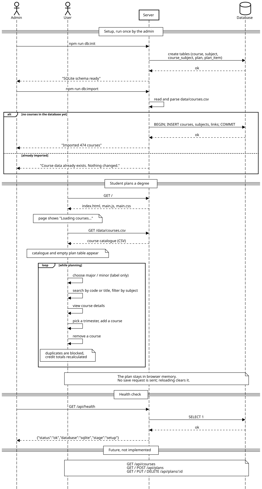
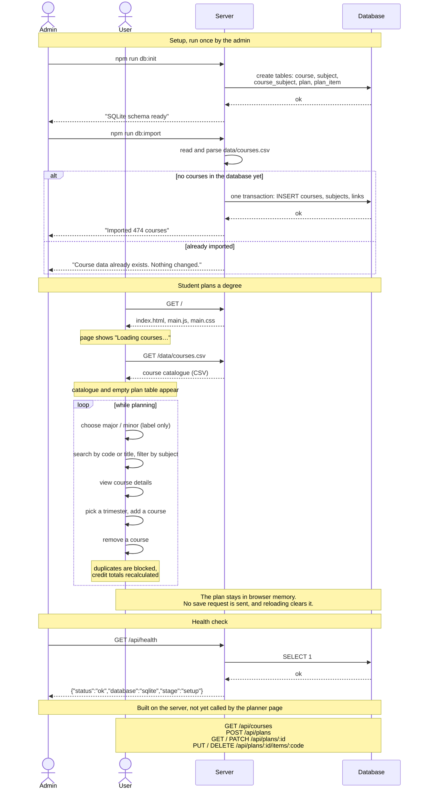

# Sequence diagram

Four participants: the **Admin** who sets the database up, the **User** (a
student in the browser), the **Server** (`server/app.py`) and the **Database**
(`data/tracey.sqlite`). It shows what the prototype actually does today, and
marks the plan-saving routes the server now answers but the planner page does not call yet.



The same diagram as Mermaid, which GitHub renders on its own:



## Reading it

- **Setup** happens once, from the command line. `npm run db:init` creates the
  tables; `npm run db:import` reads the CSV and inserts every course, subject
  and course–subject link inside one transaction. Running it again changes
  nothing.
- **Planning** needs the server twice: once for the page and once for
  `data/courses.csv`. Everything in the `loop` — search, filter, details, add,
  remove — happens in the browser with data it already has. No request is sent
  when the plan changes, so reloading the page clears it.
- **Health check**: `GET /api/health` runs `SELECT 1` against SQLite and
  reports `stage: "setup"`.
- **Course and plan routes** exist on the server (`tests/test_server.py`
  exercises them) but the planner page still reads the CSV and keeps its plan
  in memory. Wiring the page to them is the next step; see
  [course-map.md](course-map.md#backend-setup-and-the-next-step).

## Files

- `sequence-diagram.svg` — the image above, exported from
  <https://sequencediagram.org>. Its source is below (the SVG's `<desc>`
  also carries it, so the file can be re-imported into the editor).
- `sequence-diagram.mmd` — the same diagram as Mermaid, for the inline
  rendering on GitHub. Editable at <https://mermaid.live>.

<details>
<summary>Source for sequencediagram.org</summary>

```
title Tracey — how the MVP works

actor Admin
actor User
participant Server
database Database

==Setup, run once by the admin==
Admin->Server: npm run db:init
Server->Database: create tables (course, subject,\ncourse_subject, plan, plan_item)
Database-->Server: ok
Server-->Admin: "SQLite schema ready"

Admin->Server: npm run db:import
Server->Server: read and parse data/courses.csv
alt no courses in the database yet
  Server->Database: BEGIN; INSERT courses, subjects, links; COMMIT
  Database-->Server: ok
  Server-->Admin: "Imported 474 courses"
else already imported
  Server-->Admin: "Course data already exists. Nothing changed."
end

==Student plans a degree==
User->Server: GET /
Server-->User: index.html, main.js, main.css
note over User: page shows "Loading courses…"
User->Server: GET /data/courses.csv
Server-->User: course catalogue (CSV)
note over User: catalogue and empty plan table appear

loop while planning
  User->User: choose major / minor (label only)
  User->User: search by code or title, filter by subject
  User->User: view course details
  User->User: pick a trimester, add a course
  User->User: remove a course
  note over User: duplicates are blocked,\ncredit totals recalculated
end
note over User,Database: The plan stays in browser memory.\nNo save request is sent; reloading clears it.

==Health check==
Admin->Server: GET /api/health
Server->Database: SELECT 1
Database-->Server: ok
Server-->Admin: {"status":"ok","database":"sqlite","stage":"setup"}

==Built on the server, not yet called by the planner page==
note over User,Database: GET /api/courses\nPOST /api/plans\nGET / PATCH /api/plans/:id\nPUT / DELETE /api/plans/:id/items/:code
```

</details>
